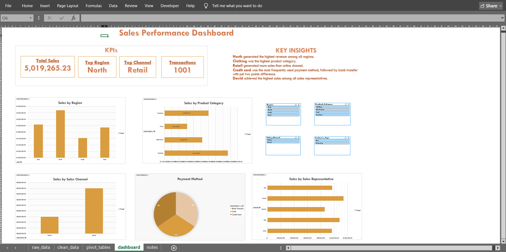

# sales-operations-dashboard

## Project Overview
This project analyzes a sales dataset containing **1,001 records** and **14 business fields** using Microsoft Excel.
The project was to identify sales performance trends and build an interactive dashboard that enables users to explore data through Pivot Tables, Pivot Charts, and slicers.

## Dataset
Records: 1,001
Columns: 14

## Fields
Product ID
Sales Date
Sales Representative
Region
Sales Amount
Quantity Sold
Product Category
Unit cost
Unit price
Customer Type
Discount
Payment Method
Sales Channel

## Tools Used
Microsoft Excel
Pivot Tables
Pivot Charts
Interactive Dashboards
Slicers
Data Cleaning

## Business Questions
Which region generated the highest sales?
Which product category generated the highest revenue?
Which sales representative achieved the highest sales?
Which payment method was used frequently?
Which sales channel generated the highest sales?

## Dashboard Preview

This interactive dashboard enables users to analyze sales performance by region, product category, sales channel, payment method, and sales representative using slicers.

## Key Insights
North generated the highest total sales.
Clothing was the highest sales in product category.
Retail generated higher sales than the Online channel.
Credit card was the most frequently used payment method.
David achieved the highest sales among all sales representatives.

## Skills Demonstrated
Data Cleaning		
Data Summarization		
Pivot Tables		
Pivot Charts		
Dashboard Design		
Data Visualization		
Business Insight generation		

## Future Enhancement
Recreate the analysis using SQL.
Automate data cleaning with Python.
Integrate with CRM platforms such as Hubspot or Zoho.
Expand the dashboard with advanced automation.
